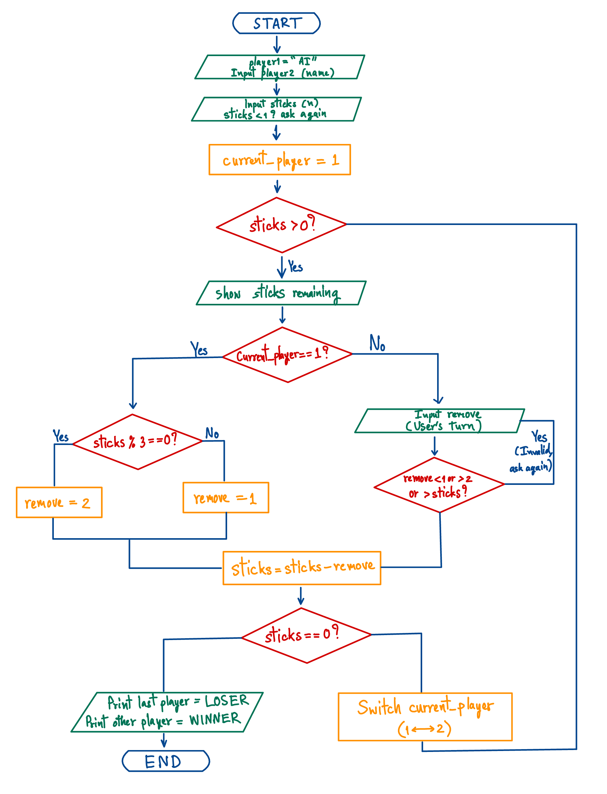

# HW02B-Sticks-690631023
# HW02B – Report: Sticks in the Pile AI Logic Game

**Course:** Data Science Programming with Python
**Name:** SUPHANATTHAKON THOBSRI
**Student ID:** 690631023

## 1. Game Description and Rules

**Sticks in the Pile** is a two-player, turn-based game. There is a pile of sticks on the table, and the players take turns removing sticks from the pile.

In Homework 02B:

* Player 1 is the **COMPUTER-AI**.
* Player 2 is the **USER**.
* The AI always moves first.
* On each turn, a player may remove **1 or 2 sticks**.
* A player may not remove more sticks than are currently left in the pile.
* The starting number of sticks `n` is entered inside the program.
* The game ends when the pile reaches `0`.
* The player who removes the **last stick** loses.
* The other player is the winner.

The program uses `input()`, `print()`, variables, `if / elif / else`, and loops. It does not use functions, lists, dictionaries, or imports.

## 2. Explanation of Logic Flow

The program works through the following steps:

1. Set `player1 = "AI"` and ask for `player2`'s name with `input()`.

2. Ask for the starting number of sticks and store it in `sticks`. If `n < 1`, reject the value and ask again.

3. Set `current_player = 1` so that the AI moves first.

4. Repeat the game while `sticks > 0`. Each pass through the loop represents one turn.

5. Print the number of sticks remaining and whose turn it is.

6. If `current_player == 1`, the AI decides how many sticks to remove:

   * If `sticks % 3 == 0`, remove `2`.
   * Otherwise, remove `1`.

7. If it is the user's turn, ask how many sticks to remove. An inner `while` loop rejects any value below `1`, above `2`, or greater than the number of sticks remaining.

8. Update the pile:

   `sticks = sticks - remove`

9. If `sticks == 0`, the player stored in `current_player` has taken the last stick and is declared the **LOSER**. The other player is printed as the **WINNER**.

10. Otherwise, switch `current_player`:

    * `1` becomes `2`
    * `2` becomes `1`

    The game then continues with the next turn.

## 3. AI Strategy

The AI strategy is based on analysing the game backwards from the end.

A position is a **LOSING position** if the player whose turn it is cannot avoid losing when the opponent plays perfectly. Otherwise, it is a **WINNING position**.

Because players can remove only 1 or 2 sticks, the losing positions repeat every 3 sticks:

**1, 4, 7, 10, ...**

These are exactly the positions where:

`sticks % 3 == 1`

### Winning and Losing Positions

| Sticks in Pile | Result for Player to Move | Reason                                                           |
| -------------: | :------------------------ | :--------------------------------------------------------------- |
|              1 | Losing                    | The player must take the last stick.                             |
|              2 | Winning                   | Remove 1, leaving 1 for the opponent.                            |
|              3 | Winning                   | Remove 2, leaving 1 for the opponent.                            |
|              4 | Losing                    | Any move leaves 2 or 3, both winning positions for the opponent. |
|              7 | Losing                    | Any move leaves 5 or 6, both winning positions for the opponent. |
|             10 | Losing                    | Any move leaves 8 or 9, both winning positions for the opponent. |

### Strategy Used by the AI

On the AI's turn:

| `sticks % 3` | AI Removes |
| -----------: | ---------: |
|            0 |   2 sticks |
|            2 |    1 stick |
|            1 |    1 stick |

When the remainder is `0`, removing 2 leaves a pile with remainder `1`.

When the remainder is `2`, removing 1 leaves a pile with remainder `1`.

Therefore, when the AI is in a winning position, it tries to leave the user a losing position.

If the AI starts in a losing position, such as `n = 10`, it still follows the same rule and waits for the opponent to make a mistake.

## 4. Flowchart

The flowchart summarizes the control flow of the program from the start of the game to the end.

The main flow is:

1. Set the player names.
2. Read and validate the starting number of sticks.
3. Set `current_player = 1`.
4. Repeat turns while `sticks > 0`.
5. Let the AI or user choose how many sticks to remove.
6. Validate the user's input when necessary.
7. Subtract the selected amount from the pile.
8. Check whether the pile has reached `0`.
9. Declare the player who took the last stick as the loser.
10. Otherwise, switch turns and continue.

## 5. Variables Used

The program uses five main variables:

| Variable         |  Type | Meaning                                           |
| :--------------- | :---: | :------------------------------------------------ |
| `player1`        | `str` | Name of Player 1, fixed as `"AI"`.                |
| `player2`        | `str` | Name of Player 2, entered by the user.            |
| `sticks`         | `int` | Number of sticks currently remaining in the pile. |
| `current_player` | `int` | `1` for the AI and `2` for the user.              |
| `remove`         | `int` | Number of sticks removed during the current turn. |

## 6. Worked Example – `n = 10`

For a starting pile of 10 sticks:

`10 % 3 == 1`

Therefore, the AI starts in a losing position against a perfect opponent.

| Turn | Player | Sticks Before | `sticks % 3` | Remove | Sticks After |
| :--: | :----- | ------------: | -----------: | -----: | :----------- |
|   1  | AI     |            10 |            1 |      1 | 9            |
|   2  | Ben    |             9 |            0 |      2 | 7            |
|   3  | AI     |             7 |            1 |      1 | 6            |
|   4  | Ben    |             6 |            0 |      2 | 4            |
|   5  | AI     |             4 |            1 |      1 | 3            |
|   6  | Ben    |             3 |            0 |      2 | 1            |
|   7  | AI     |             1 |            1 |      1 | 0            |

At turn 7, the AI takes the last stick.

**Result: AI loses and Ben wins.**

The example in the notebook also describes a case where Ben first enters an invalid amount (`5`) and then enters a valid amount (`2`) on turn 4. The program rejects invalid input and asks the same player again.

## 7. Written Explanation

### Turn Control

The variable `current_player` keeps track of whose turn it is.

It starts at `1`, so the AI moves first. An `if / else` statement selects either the AI's branch or the user's branch.

After a valid move that does not end the game, the program switches the value of `current_player` from `1` to `2` or from `2` to `1`.

### Winner Decision

After every valid move, the program updates `sticks`.

When `sticks == 0`, the player stored in `current_player` has taken the last stick. That player is therefore the loser, and the other player is declared the winner.

## 8. Repository Files

* `HW02B_Sticks_Report_690631023.ipynb` – Main Jupyter Notebook containing the program, explanation, theory, flowchart reference, and worked example.
* `README.md` – Short written report for the GitHub repository.
* `flowchart.png` – Flowchart of the program.
